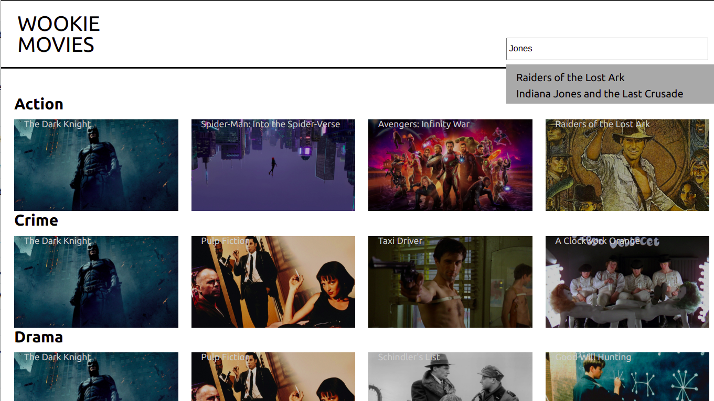
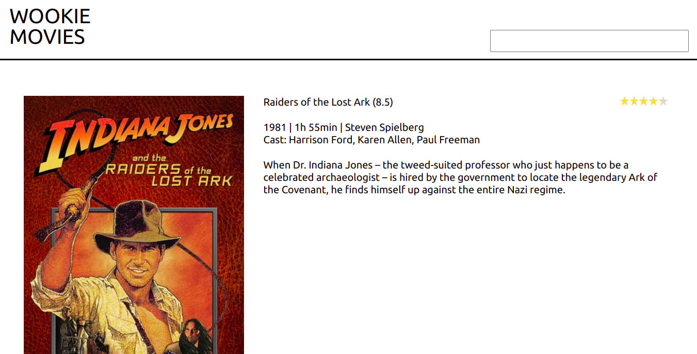

# Wookie Movie - A movie catalogue app using Vue.js 

**Features:**
- Listing movie elements, organized by categorie (using a public movie API)
- Searching a movie
- Movie details page

**Screenshots:**






*** 
## Project setup
```
yarn install
```

### Compiles and hot-reloads for development
```
yarn serve
```

### Compiles and minifies for production
```
yarn build
```

### Lints and fixes files
```
yarn lint
```

### Customize configuration
See [Configuration Reference](https://cli.vuejs.org/config/).
